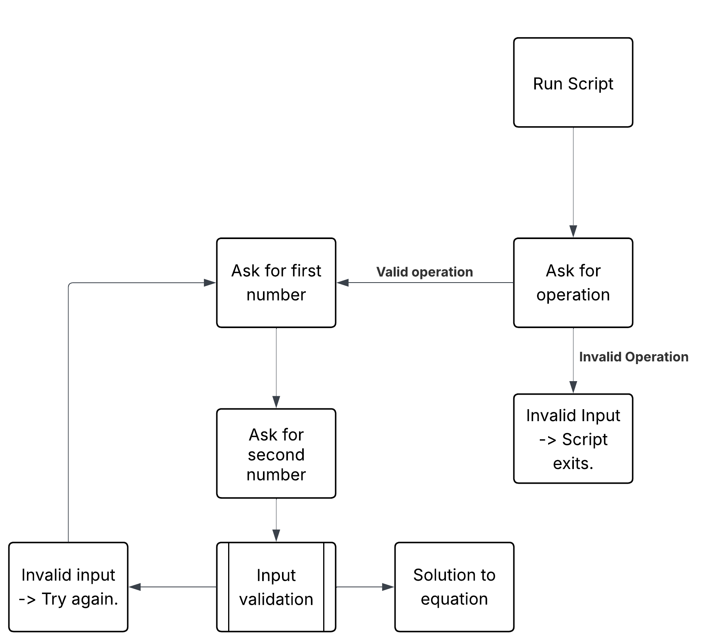

## "Meh"-thematical Calculator
#### by Owen Milota
This is a simple script, which will run simple mathematical operations for you, to its own dismay.

## Installation
Simply clone the repo and run the `calc.py` script.  
This can be done by opening a terminal and running
```sh
git clone https://github.com/WTCSC/the-meh-thematical-calculator-RandomHuman2020
cd the-meh-thematical-calculator-RandomHuman2020
python calc.py
```
## Requirements
- Git
- Python 3
- PyTest

## Usage
This script does not take any command-line arguments. Simply input the options presented to you, then two whole numbers to run a calculation

## Contributing
If you wish to contribute code to this project, fork the repo, make your changes, and make a pull request.
Make sure to run pytest before making a pull request, as non-functional code will not be accepted.
```bash
pytest
```
or
```bash
pytest -v
```
in the project directory.

## Licensing
This project is licensed under the BSD Zero Clause License.

See LICENSE.md for more info.

## Flowchart

